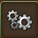
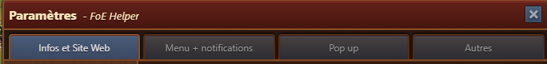
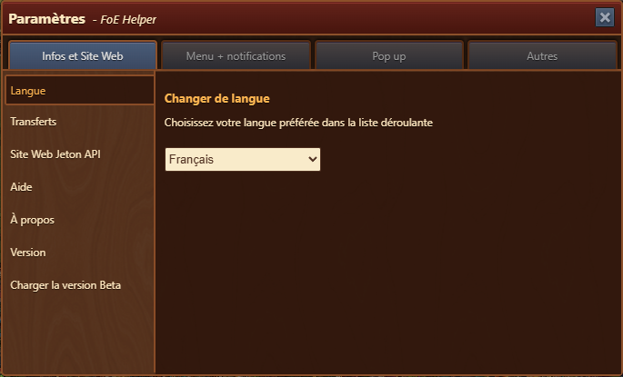
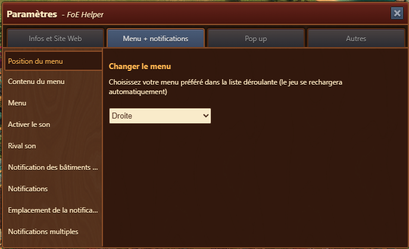
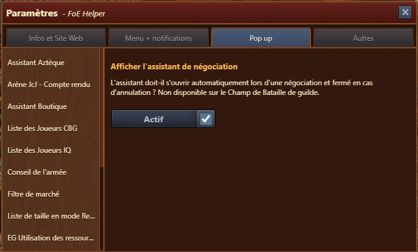
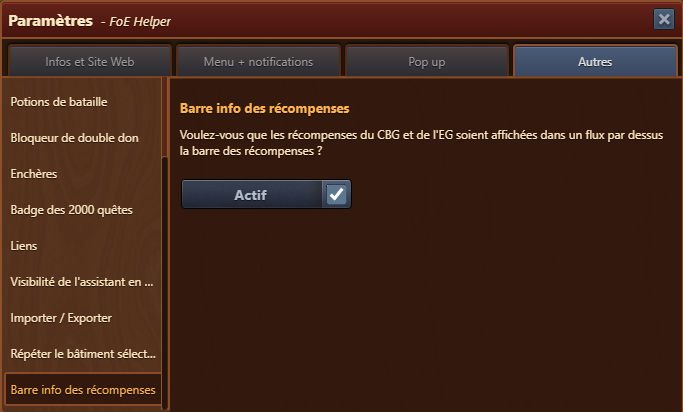
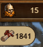

# Gestion des Paramètres 

Ce module permet de gérer les paramètres généraux de l'application

## Aperçu du menu

Le module est partagé en 4 onglets qui gérent différents aspects du module

* [**Info et Site Web**](#info-et-site-web) - Informations générale sur l'assistant Foe Helper
* [**Menu + Notifications**](#menu--notifications) - Contrôle la position du menu, les sons et les paramètres de notification.
* [**Pop up**](#pop-up) - Contrôle quels modules s'ouvrent automatiquement
* [**Autres**](#autres) - Gère quel module est actif dans l'assistant

## Info et Site Web

Informations générale sur l'assistant Foe Helper

Les options suivantes sont disponibles :
- **Langue** : change la langue de l'interface utilisateur. Déclenche un rechargement automatique du jeu
- **Transferts** : Utilisé pour transférer les notes et les données du plan de cité vers [Foe-Helper.com](https://foe-helper.com/)
- **Site Web Jeton API** : Utilisé pour l'authentification sur [Foe-Helper.com](https://foe-helper.com/)
- **Aide** : Fourni les liens vers les ressources officielles :
	* Site web [Foe-Helper.com](https://foe-helper.com/)
	* Discord [Chanel](https://discord.com/invite/z97KZq4)
	* Github [Github](https://github.com/mainIine/foe-helfer-extension/issues)
- **A propos** : Affiche des détails variés a propos de l'assistant
- **Version** : Affiche les infos suivantes (Log du dernier Change, Votre ID Joueur, Votre ID de guilde, Votre ID du monde actuel)
- **Charger la version Beta** : Charger la version Beta actuelle


Évitez d'utiliser simultanément la version bêta et la version standard.


### Traduction

vous pouvez participer à la traduction via le site [weblate](http://i18n.foe-helper.com/)

## Menu + Notifications

Contrôle la position du menu, les sons et les paramètres de notification.

Les options suivantes sont disponibles :
- **Position du menu** : bouge le menu de FoE Helper vers :
	* Bas
	* Droite
	* En Fenêtre (flottant)

En fonction de la résolution et du zoom, le mode fenêtre peut être appliqué automatiquement.

- **Contenu du menu** : Cliquez pour basculer la visibilité des icônes dans la barre de menu FOE Helper.
- **Menu** : Détermine combien d'îcones sont visibles dans le menu
- **Activer le son** : Active le son dans les modules supportés
- **Son Rival** : Active le son pour les quêtes terminées du Rival
- **Notifications des batiments expirés** : Si cette option est activée, des alertes seront automatiquement créées pour les bâtiments à durée limitée, pour avertir lorsque le bâtiment est en ruine.
- **Notifications** : Active ou désactive toutes les notifications de FoE Helper
- **Emplacement des notifications** : Choisissez où les notifications apparaissent à l'écran. Après avoir choisi un **Aperçu** de notification apparaîtra.
- **Notifications multiples** : Contrôlez le nombre de notifications pouvant être empilées en même temps.

## Pop Up

Active/désactive l'ouverture automatique de divers outils d'assistance pendant le jeu.

Les options suivantes sont disponibles :
- **Négociations** : Ouvre l'assistant de négociation pendant les négociations (non autorisé dans GBG).
- **Assistant d'événement** : Ouvre divers assistants d'événement lorsqu'une fenêtre d'événement est ouverte.
- **Alerte voyou Uniquement** : Affiche une notification lorsqu'il ne reste plus que des voleurs dans la prochaine vague d'une bataille.
- **Galaxie Bleue** : Ouvre la [Aide Galaxie bleue] (../galaxie-bleue/README.md) pendant la collecte.
- **Aperçu des Alliés** : Ouvre l'[Aperçu des alliés] (../allie/README.md) lorsque le menu Alliés historiques est ouvert.
- **Affiche Total des Pf investi** : Ouvre le [Résumé de l'investissement FP] (../investissement_PF/README.md) lorsque le menu **Hôtel de ville > Contributions aux Grands Monuments** est ouvert. 
- **Export tréso. guilde** : Ouvre une fenêtre pour exporter les contributions du trésor de guilde lorsque le **Menu de guilde > Options > Contributions** est ouvert en jeu.

Ne revenez pas en arrière dans les pages pendant la lecture. Cela peut entraîner des données en double lors de l'exportation.

- **Recommandation Bâtiment CbG** : Lorsque le menu de construction de province est ouvert, le menu affiche un tableau trié des combinaisons de bâtiments les plus efficaces pour une province GBG, triées selon leur impact relatif sur le trésorie de guilde.
- **Fenêtre d'info** : lance [Info Système](../info_technique/README.md) au démarrage du jeu
- **Fermer toutes les Fenêtres** : Affiche  [Fermer toutes les Fenêtres](../fermer/README.md) au démarrage du jeu
- **Info d'éclaireur** : Ouvre automatiquement les  [Infos de l'éclaireur]( (../eclaireur/README.md) lorsque la carte du continent dans le jeu est ouverte et que la reconnaissance est disponible.
- **Bloqueur de négociation** : Bloque le bouton de négociation sur la carte de campagne pour empêcher toute négociation indésirable.
- **Bloqueur Collecter Tout** : Bloque le bouton **Collecter Tout** si les pf ne peuvent pas être collectés ou si tous les batiments ne sont pas motivés
- **Assistant Aztèque** : Ouvre automatiquement [Assistant min-jeu Aztèque](../azteque/README.md) quand le mini-jeu Aztèque est ouvert.
- **Arène JcJ - Compte rendu** : Ouvre automatiquement [Arène JcJ](../arene_jcj/README.md) quand l'arène JcJ est ouverte.
- **Assistant Boutique** : Ouvre automatiquement [Assistant Boutique](../boutique/README.md) quand la boutique d'objet est ouverte.
- **Liste des joueurs CbG** : Ouvre automatiquement [Aperçu CbG](../cdb/README.md) lorsqu'on clique sur le classement CbG.
- **Liste des joueurs IQ** : Ouvre automatiquement [Aperçu IQ](../qi-joueur/README.md) lorsqu'on clique sur le classement CbG.
- **Conseil de l'armée** : Ouvre automatiquement [Conseil de l'armée](../conseil-armee/README.md) en fonction des paramètres sélectionnés.
- **Filtre du marché** : Ouvre automatiquement [Filtre du marché](../marche/README.md) quand le marché des ressources est ouvert.
- **Liste de taille en mode reconstruction** : Ouvre automatiquement [Liste de reconstruction](../reconstruction/README.md) quand le mode de reconstruction du jeu est ouvert.
- **EG Utilisation des ressources** : Ouvre automatiquement [Coût EG](../cout_eg/README.md) quand un niveau d'EG est débloqué.

## Autres

Ajustements de l'interface utilisateur, fonctionnalités avancées, importation/exportation et options d'assistance supplémentaires.

Les options suivantes sont disponibles :
- **Fenêtre** : Réinitialise les positions des fenêtres au centre de l'écran au cas où elles seraient hors écran.
- **Calculatrice GM** : Permet l'utilisation de [Calculatrice GM interne](../calculatrice_gm_interne/README.md)sur les GM des autres joueurs.
- **Activité PO/MO** : Enregistre les données [Aide Motivation / Polissage](../motivation/README.md)

Si elle est désactivée, l'icône PO/MO est masquée même si elle est activée ailleurs.

- **Potion de bataille** : Active le module [Potions de bataille](../potion/README.md) pour surveiller la durée des boosts actifs 

L'activation de cette option peut ne pas supprimer/afficher immédiatement l'icône - attendre ou recharger.

- **Bloqueur de double don** : Active une boîte sur le champ de saisie PF lorsque le don sur le GM a été effectué.
- **Enchères** : Activation du calcul automatique de l'augmentation de l'enchère et des copies dans le presse-papiers en fonction des paramètres sélectionnés.
- **Badge des 2000 quêtes** : Active le badge dans le coin supérieur gauche affichant le compteur des quêtes abandonnées 

- **Liens** : Ajoute un lien vers [foe.scoredb.io](https://foe.scoredb.io) ou vers [foestats.com](//https://foestats.com/) dans les profils des joueurs et remplace le le nom des kits de constructions par un lien vers forgeofempires.fandom.com
- **Visibilité de l'assistant en bataille** : Masque l'interface Helper lors des combats manuels (uniquement en mode "En Fenêtre ").
- **Importer / Exporter** : Vous permet de sauvegarder et de restaurer vos paramètres et données FOE Helper via [Import-Export] (../import-export/README.md). (par exemple, changement d'appareil)
- **Répéter le bâtiment sélectionné** : Active la sélection automatisée du dernier bâtiment placé en mode reconstruction, permettant un placement plus rapide des bâtiments.

Possibilité de déclencher la détection des bots d'INNO et de provoquer une courte période de bannissement. S'il vous plaît laissez-nous savoir si cela se produit.. [Contact](#info--site-web)
