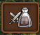
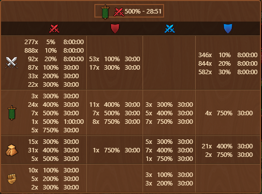
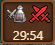

# Potions de bataille


Ce module peut-être activé dans [parametres](../parametres/README.md#autres)


Le module **Potions de bataille** affiche une icône dans le coin supérieur droit de l'écran. Lorsqu'un effet de potion est actif, il affiche le **boost actif restant le plus court** et, lorsque vous le survolez, affiche un **résumé de toutes les potions de votre inventaire**.

## Structure

Le menu est structuré comme suit :

- **Aperçu de l'effet** : affiche le type d'effet actuel (par exemple, Rouge pour l'attaque), le pourcentage de bonus (par exemple, 10 %) et le temps restant (par exemple, 7:59:52).
- **Tableau d'inventaire des potions** : Répertorie les potions par type, montrant :
  - Nombre de potions disponibles
  - Force d'effet (%)
  - Durée de chaque type de potion
  
## Utilisation

Une fois qu'une potion est activée :
- L'icône sera mise à jour pour refléter le **type de boost actif** et la **durée restante**.

- Le survol de l'icône ouvrira l'[Structure](#structure), affichant des informations détaillées sur l'inventaire et l'état.

## FAQ

**Q : Que signifient les trois valeurs affichées à côté de chaque potion ?** 
R : Ils indiquent le nombre de potions disponibles dans l'inventaire, le pourcentage d'effet fourni et le temps restant pour cet effet (par exemple, 329x 5% 8:00:00).

**Q : Puis-je voir plusieurs potions simultanément ?** 
R : Non, l'icône affichera uniquement le **boost actif restant le plus court**.  