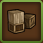
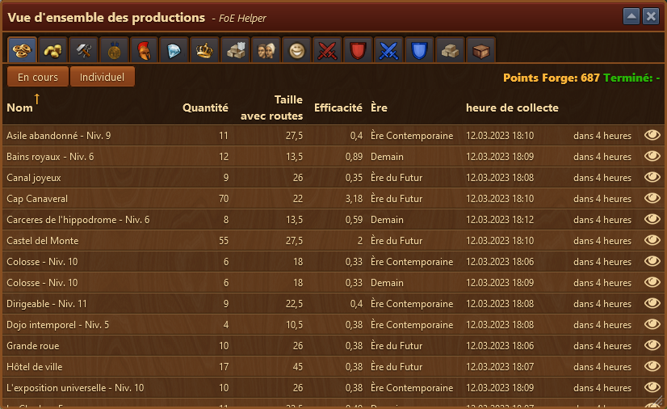
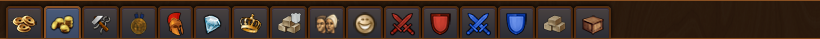
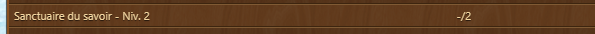

# Aperçu Production

Ce module vous donne un aperçu de toutes vos productions.

## Structure

La fenêtre est composée de plusieurs onglets, un par production / catégorie, est affiche pour chacun d'eux le détail de chaque production :
* La quantité
* La taille du batiment avec la route
* Son efficacité
* l'ère du batiment
* Heure de la collecte
* Le reste du temps à attendre
* Un raccourci  pour afficher son emplacement sur le [plan de la ville](../ville/README.md)

### Les onglets

* Vue des récoltes de PF
* Vue des récoltes de pièces d'or
* Vue des récoltes de marchandises
* Vue des récoltes de médailles
* Vue des récoltes de troupes
* Vue des récoltes de diamants (l'onglet reste vide, l'assistant n'affiche pas les diamants récoltés)
* Vue des récoltes de puissance de guilde
* Vue des récoltes de ressource pour la guilde
* Vue des batiments qui donnent de la population
* Vue des batiments qui donnent de la joie
* Vue des batiments qui donnent des % d'attaque pour l'armée d'attaque
* Vue des batiments qui donnent des % de défense pour l'armée d'attaque
* Vue des batiments qui donnent des % d'attaque pour l'armée de défense (celle de la ville)
* Vue des batiments qui donnent des % de défense pour l'armée de défense (celle de la ville)
* Vue des batiments qui donnent des ressources
* Récapitulatif par genre de batiment de chaque production

### Détail

 

Dans chaque onglet est affiché le total de la récolte. Pour les pf, on indique en plus si vous avez tous les batiment qui sont motivés ou pas et donc si vous avez le plein de pf.
Dans l'exemple ci-dessus, on voit qu'il manque 2 pf pour avoir le total.
Dans la liste des batiments, on va pouvoir voir lequel :

le "-" devant indique que ce sanctuaire du savoir n'a pas encore étét motivé / poli.

