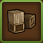
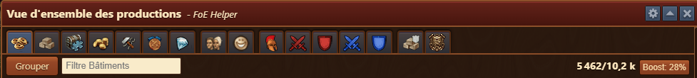
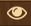
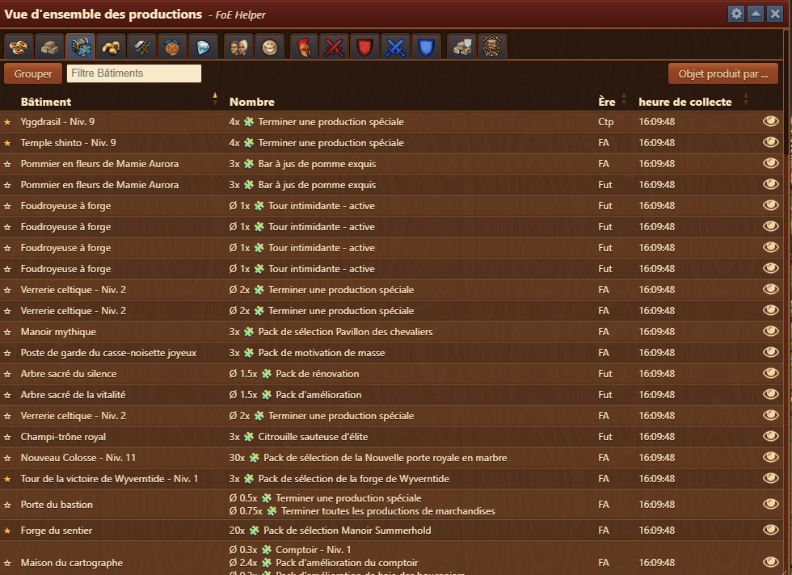
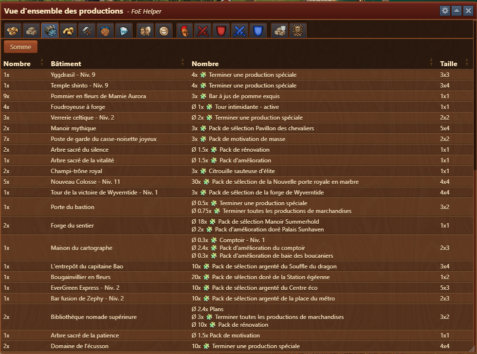
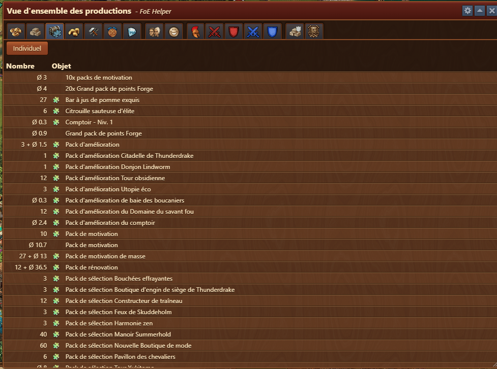
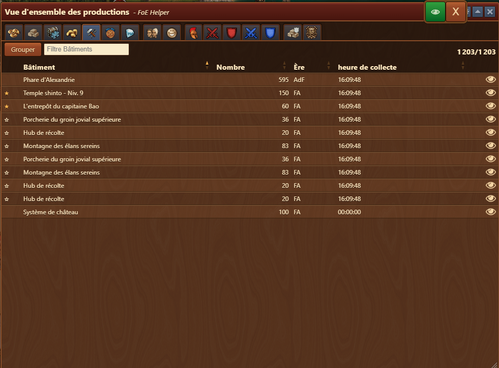
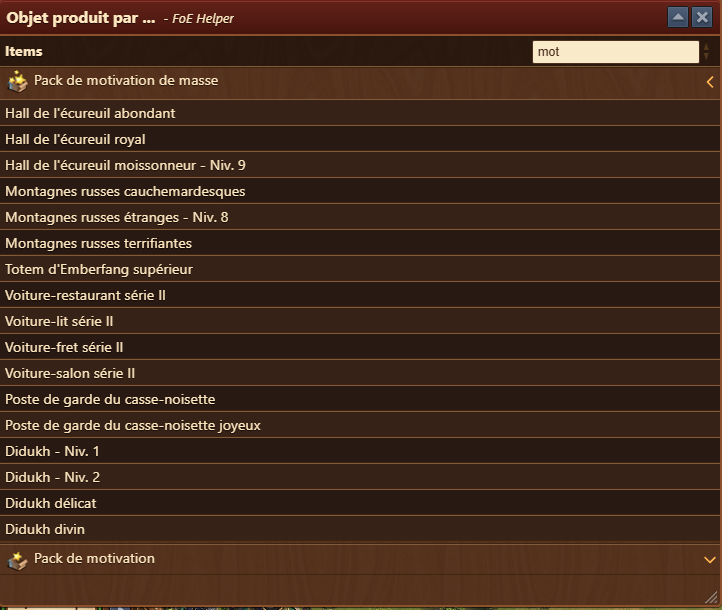
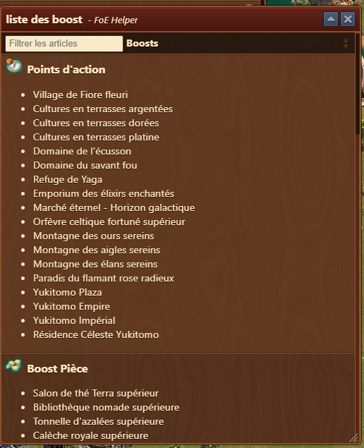
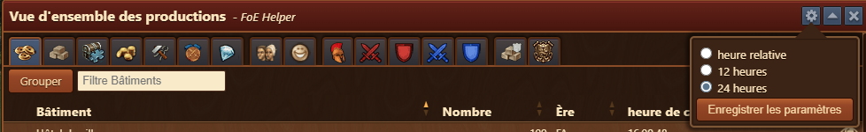

# Aperçu Production

Ce module vous donne un aperçu de toutes vos productions.

## Structure

La fenêtre comporte plusieurs onglets, chacun dédié à une production ou une catégorie spécifique, affichant les détails de chaque production.

L'aperçu de la production est structuré comme suit, de haut en bas :
- **Barre de titre** avec un menu [Configuration](#configuration)
- **Onglets** - Un onglet par type de ressource :

<cliquez pour ouvrir la liste

    - Production FP
    - Production de biens
    - Production de fragments
    - Pièces de monnaie
    - Fournitures
    - Médailles
    - Diamants
    - Population
    - Bonheur
    - Unités
    - Attaque (armée attaquante)
    - Défense (armée attaquante)
    - Attaque (Armée en défense)
    - Défense (Armée en défense)
    - Pouvoir de guilde
    - Marchandises de guilde
    - Ressources IQ

- **Groupe** - Bouton pour modifier l'affichage du tableau sur un onglet spécifique :
  - [Vue liste](#lvue-liste) (par défaut)
  - [Vue de groupe](#vue-groupée)
  - [Vue somme](#vue-somme)
- **Filtre** - Champ de saisie qui filtre n'importe quelle colonne (par exemple filtrer des bâtiments, une époque, des fragments spécifiques)
- **Production actuelle/Production maximale :**
   - **Production actuelle** - Ressources actuellement produites en fonction de l'état de motivation
   - **Production maximale estimée** - Production maximale théorique en considérant que tous les bâtiments sont motivés et que la valeur moyenne de la production des bâtiments produisant cette ressource par hasard (par exemple, un bâtiment qui a 20 % de chances de produire 100 FP sera calculée comme une production de ∅20 FP)

## Usage

Chaque onglet affiche la production actuelle en fonction de l'état de motivation des bâtiments, ainsi que la production maximale estimée.

 - Un contour en étoile  devant le nom d'un bâtiment indique qu'il n'est toujours pas motivé ou poli.
 - Le symbole ∅ représente la valeur moyenne de collecte d'un bâtiment spécifique ( [valeur de production] x [chance de produire cette ressource] ).

### Vue liste

Il s'agit de la vue par défaut disponible sur tous les onglets. Il affiche des informations détaillées pour chaque bâtiment individuel, notamment :
- Statut de motivation (un contour en étoile indique que vous n'êtes pas motivé)
- Quantité produite
- Époque et temps de production
- Icône , qui ouvre l'[Aperçu de la ville](../vile/README.md) avec le bâtiment en surbrillance

### Vue groupée

Cette vue résume la production par type de bâtiment. Il montre :
- Nombre de bâtiments placés
- Production totale dans ces bâtiments
- Empreinte (taille)

**Remarque :** Dans l'onglet *Fragments*, la quantité est affichée par bâtiment plutôt que résumée

### Vue somme

Disponible dans les onglets *Fragments* et *Unités*. Cette vue affiche un résumé de la production totale :
- Par type de fragment (par exemple, ruée vers le ravitaillement en masse de 30 m, ruée vers le ravitaillement en masse sur 6 h)
- Par type de troupe (pour la production armée)

Utile pour évaluer rapidement quels fragments ou unités sont générés.

### Vue des pourcentages de boost

Ce bouton bascule apparaît en haut à droite des onglets *FP*, *Pièces* et *Marchandises*. Lorsqu'il est activé, il filtre le tableau pour afficher uniquement les bâtiments qui contribuent à des augmentations basées sur un pourcentage au type de ressource sélectionné (par exemple, +5 % de production de FP).

Il permet d'identifier les bâtiments de soutien qui améliorent la production de votre ville.

exemple pour les marchandises :

### Menu Objet produit par...

Ce menu est disponible dans l'onglet *Fragments*. 

Utile pour localiser où les objets rares sont générés.

### Menu Liste boost IQ

Ce menu est disponible dans l'onglet *Ressources IQ*

il permet de voir quel batiment donne quel boost au début ou pendant l'IQ.

## Configuration

Le menu de configuration permet aux utilisateurs de personnaliser la manière dont l'heure est affichée dans l'interface Aperçu de la production. 

Les options disponibles incluent :
- **Heure relative** - par exemple, "dans 5 minutes" ou "dans 12 heures"
- **Horloge de 12 heures** - Format d'heure fixe (par exemple, "14h30")
- **Horloge 24 heures** - Format d'heure fixe (par exemple, "14:30")

Ce paramètre améliore la lisibilité et les préférences de l'utilisateur en permettant à chaque utilisateur de choisir le format qui correspond le mieux à ses habitudes ou aux normes régionales.

## FAQ

**Q : Pourquoi certains bâtiments affichent-ils une icône en forme d'étoile ?** 
R : Cela signifie qu’ils sont motivés ou polis.

**Q : Que signifie ∅ en production ?** 
R : Il montre le rendement moyen des bâtiments dont la production est basée sur le hasard.

**Q : Puis-je filtrer par époques ou noms de bâtiments spécifiques ?** 
R : Oui, utilisez l'entrée de filtre au-dessus du tableau pour rechercher n'importe quelle colonne.

**Q : que signifie le personnage orange après le nom de certains bâtiments ?** 
R : Cela signifie qu'il y a un emplaçement pour un allié