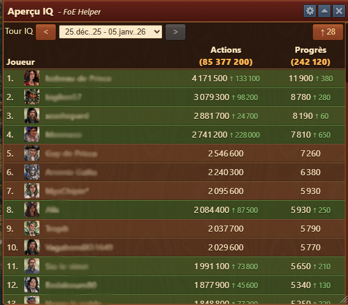
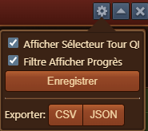

# Aperçu Joueur IQ


Ce module peut-être activé dans [parametres](../parametres/README.md#pop-up)


Le module **Aperçu Joueur IQ** affiche un classement des actions et des progrès des membres de la guilde dans les Incursions Quantiques  au cours du tour sélectionné, aidant ainsi les dirigeants et les joueurs à surveiller les efforts individuels et collectifs.

## Structure

La fenêtre Aperçu QI est structurée comme suit :

- **Barre de titre** avec menu [Configuration](#configuration)
- **Sélecteur de Tour IQ** : liste déroulante pour sélectionner le tour QI (plage de dates)
- **⬆** : bouton de filtre de progression, filtre la liste pour afficher uniquement les joueurs qui ont eu une activité depuis le dernier instantané.
- **Liste des joueurs** : Classement des membres par :
  - **Actions** : nombre total d'actions effectuées
  - **Progrès** : Points contribués à la barre de progression globale de la guilde
  
  
Les lignes en surbrillance indiquent une augmentation de l'activité depuis le dernier instantané (par exemple, « + 10 100 actions)


## Configuration

L'interface de configuration est structurée de haut en bas comme suit :
- **Afficher le sélecteur de tour QI** : affiche le sélecteur de tour QI dans [Structure](#structure)
- **Afficher le filtre Progrès** : affiche le bouton **⬆** dans [Structure](#structure)
- **Enregistrer** : bouton pour enregistrer les configurations des cases à cocher
- **Export** : vous permettant d'exporter des données vers `CSV` ou `JSON` pour les archiver

## Utilisation

- Ouvrez la fenêtre de classement des membres de guilde en jeu pendant un tour QI actif ou passé.
- L'aperçu QI s'ouvrira automatiquement s'il est activé dans [Paramètres] (../settings/README.md#pop-ups-tab).
- Utilisez le sélecteur de ronde pour choisir la période que vous souhaitez analyser.
- Observez les indicateurs de couleur pour suivre les changements récents.
- Filtrez la liste via **⬆** pour analyser qui a progressé depuis le dernier instantané.
- Les données sont mises à jour chaque fois que la fenêtre de classement des membres de la guilde dans le jeu est ouverte.

## Utilisation

- Comparez les niveaux d'activité à travers la guilde
- Identifier les meilleurs contributeurs
- Encourager les membres les moins actifs
- Planifiez des récompenses ou des classements de guilde en fonction de la participation

##FAQ

**Q : Pourquoi me manque-t-il des données pour certaines saisons ?** 
R : Les données sont mises à jour chaque fois que la fenêtre de classement des membres de guilde en jeu est ouverte.

**Q : Que sont les « Actions » ?** 
R : Les actions font référence aux actions dépensées pendant le tour d'incursions quantiques.

**Q : Que signifie le chiffre vert à côté de certaines entrées ?** 
R : Il montre l'évolution de la contribution depuis le dernier instantané, indiquant l'activité récente.

**Q : Puis-je filtrer ou trier la liste ?** 
R : La liste est triée par défaut en fonction de la progression. Le tri manuel peut ne pas être disponible.