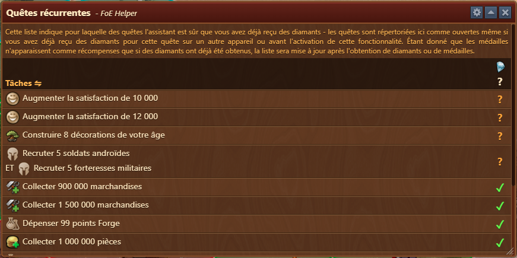
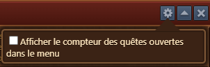
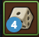

# Assistant Quêtes réccurentes

 

L'assistant de quêtes récurrentes affiche une liste de toutes les quêtes récurrentes (QR) disponibles pour votre époque actuelle. Il vous aide à planifier et à exécuter efficacement les quêtes afin de maximiser les récompenses en diamants.

## Structure

Le menu est structuré comme suit :

- **Barre d'en-tête** avec options [Configuration](#configuration)
- [**Liste des tâches**](#liste-des-taches) affichant les quêtes récurrentes ouvertes et terminées

## Configuration

Le menu de configuration permet d'afficher le compteur de badges, pour les QR non collectés, sur l'icône du menu 

## Liste des tâches

Les quêtes récurrentes sont présentées sous forme de tâches structurées, avec des indicateurs indiquant si les diamants ont été collectés lors d'une quête spécifique ou sont toujours disponibles. Chaque quête peut nécessiter une ou plusieurs réalisations avant de collecter des diamants.

- **Les tâches marquées d'une coche** sont terminées et les diamants sont réclamés.
- **Les tâches marquées d'un point d'interrogation** indiquent des diamants en cours ou non réclamés.

## Comment utiliser

- En cliquant sur **Tâches** dans le menu d'en-tête, la vue de la liste changera pour afficher le nom des tâches au lieu des exigences des tâches.
- Utilisez les indicateurs d'achèvement comme liste de contrôle des tâches pour suivre efficacement la collecte de diamants.
- Surveillez la liste des quêtes et planifiez les actions qui peuvent être accomplies simultanément (par exemple, gagner des batailles tout en collectant des pièces).
- Si une quête propose une méthode d'achèvement alternative (comme la bataille **OU** la négociation), choisissez l'option qui correspond le mieux à votre stratégie ou aux ressources disponibles.

### Gestion de quête interactive

- Si vous êtes sûr d'avoir collecté des diamants pour une quête spécifique sur un autre appareil, cliquez et maintenez enfoncé un **point d'interrogation** dans la liste des tâches pendant 10 secondes pour le marquer d'une **coche**.

## FAQ

**Q : Pourquoi certaines quêtes semblent-elles ouvertes même si je les ai déjà terminées ?** 
R : Les quêtes récurrentes peuvent apparaître ouvertes si les diamants ont déjà été réclamés sur un autre appareil. L'assistant suit l'achèvement des quêtes par appareil.

**Q : Mon montant de diamants n'a pas augmenté, mais certains RQ sont marqués comme terminés ?** 
R : Étant donné que les médailles n'apparaissent comme récompenses que si les diamants ont été obtenus auparavant, la liste sera mise à jour une fois les diamants ou les médailles récupérés.