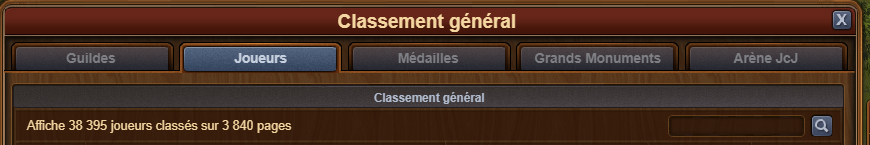
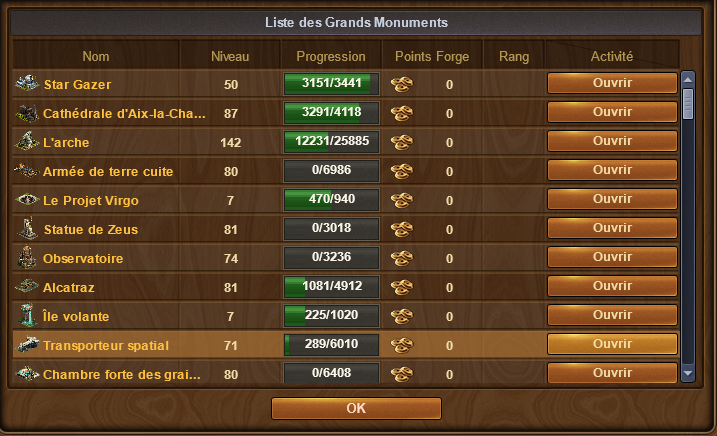
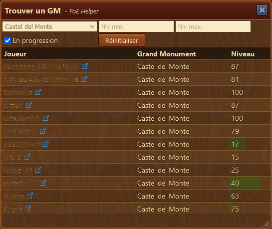

# Recherche Grand Monument

 

Ce module permet de trouver facilement parmis vos amis, voisins ou membres de guilde, le GM de votre choix pour y investir.
## Structure

La fenêtre comporte la liste des GM a chercher. Vous ne pouvez relever qu'un GM à la fois. Vous pouvez restreindre la recherche avec une restriction sur les niveaux minimal et maximal recherché.

La case à cocher **En Progression**, permet de n'afficher que les GM qui ont déjà des PF posés.

## Utilisation

Vous devez avoir cette fenêtre ouverte puis vous parcourez la liste des GM de vos voisins, amis ou membres de guilde.

via la barre sociale  ou via le classement général 

Vous devez à chaque fois ouvrir la liste des GM du joueur.

Au fur et à  mesure, de vos visites, la liste des joueurs qui ont le GM selon vos critères se remplit.
Le taux des PF déjà posé est affiché avec une barre verte.

