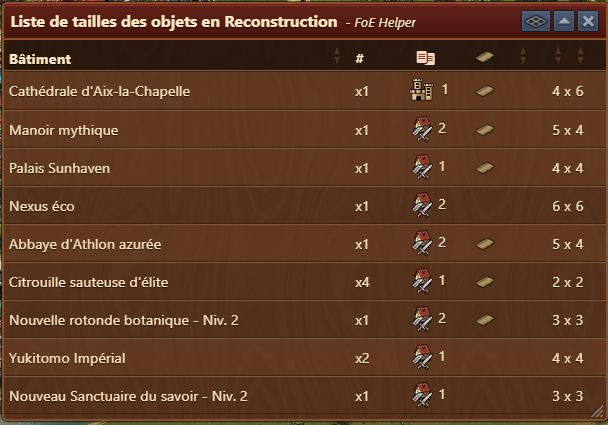
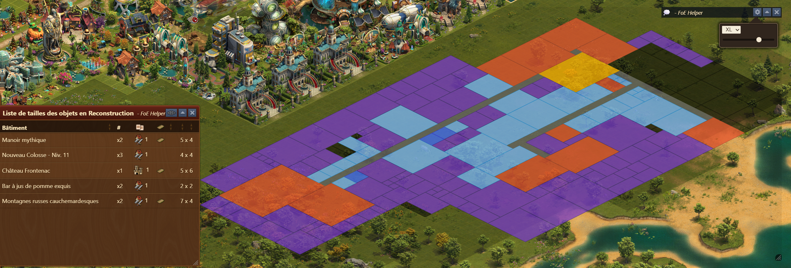
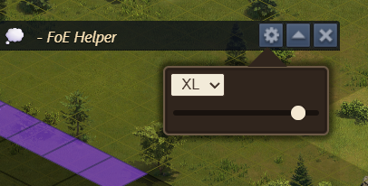

# Liste de reconstruction


Ce module peut-être activé dans [parametres](../parametres/README.md#pop-up)


Le module **Liste de reconstruction** fournit un aperçu rapide des bâtiments dans votre inventaire en mode reconstruction, montrant leurs dimensions et leurs quantités pour faciliter une planification urbaine efficace et une optimisation de l'aménagement.

## Structure

Dans la barre de menu, la possibilité d'afficher la [carte à plat de la ville](#carte-de-la-ville) en cliquant sur le symbole **expansion**

Le tableau comprend les colonnes suivantes :

- **Bâtiment** : Nom du bâtiment stocké en mode Reconstruction.
- **# (Quantité)** : Affiche le nombre d'instances de chaque bâtiment disponibles.
- **Indicateurs d'icônes** : indique dans quel bâtiment de menu est stocké (par exemple, les bâtiments de production)
- **Route** : Indique si le bâtiment doit être relié par une route.
- **Taille** : Dimensions du bâtiment (largeur × hauteur).

## Utilisation

- Ouvrez le mode de reconstruction dans le jeu.
- Le module est automatiquement lancé. (si activé dans [Paramètres](../parametres/README.md#pop-up))
- Utilisez la liste pour :
    - Comparez les bâtiments similaires par taille pour prioriser le placement.
    - Triez les bâtiments par taille ou par exigence routière.
    - Planifiez les aménagements à l'avance, en sachant exactement combien et quelles tailles réserver.

### Carte de la ville

le plan de la ville s'affiche avec la disposition actuelle des bâtiments. Si des bâtiments sont enlevés, alors les carrés sont noircis.
les couleurs sont les couleurs utilisées dans [l'aperçu de la cité](../ville/readme.md)
et en violet les bâtiments ne nécessitant pas de routes.

#### Option de la carte

le menu option offre la possiblité de :

 - via la liste déroulante de choisir la grandeur de la carte (S, M, L, XL)
 - via le bouton horizontal de choisir la force de la transparence de la carte
 - déplacer la carte de ville en cliquant / tenant sur la barre noire du menu de la carte

## FAQ

**Q : Comment puis-je accéder à cette liste ?**  
R : En l'activant dans le menu [Paramètres] (../parametres/README.md#pop-up)), il est automatiquement lancé lorsqu'il est entré en mode de reconstruction.

**Q : Puis-je placer directement des bâtiments de cette liste ?**  
R : Non, ce module est uniquement informatif. Le placement doit être effectué dans le jeu.

**Q : Est-ce que cela montre les bâtiments qui ne sont pas encore stockés ?**  
R : Non, il répertorie uniquement les bâtiments actuellement stockés en mode Reconstruction.

**Q : Que signifient les icônes ?**  
R : Indique où le bâtiment est stocké dans le menu du jeu.