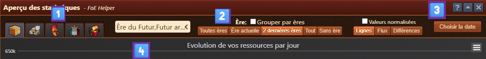
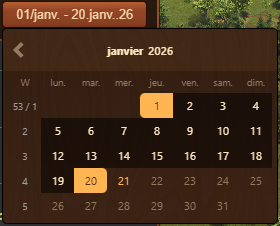
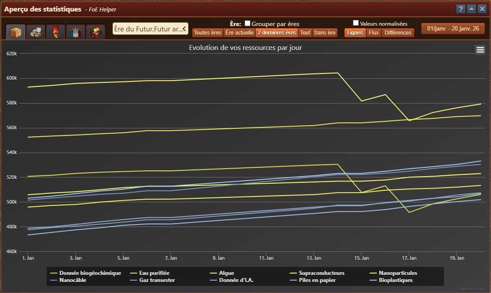
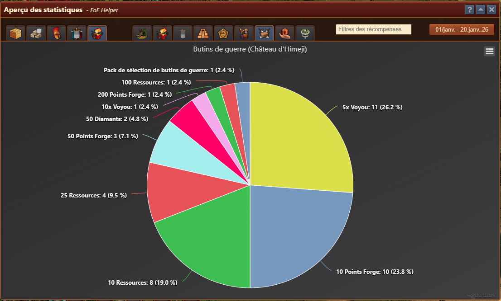
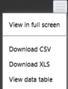

# Aperçu des statistiques

Le module Aperçu des statistiques fournit des visualisations détaillées de vos données de jeu au fil du temps. Il permet de suivre le type et la fréquence des récompenses que vous avez reçues.

## Aperçu des menus

L'aperçu des statistiques comporte plusieurs onglets, chacun dédié à une catégorie spécifique, affichant les détails de chaque groupe :

1. [**Onglets**](#onglets) :
    - Votre trésor quotidiennement
    - Trésor de guilde quotidien
    - Unités quotidiennes
    - Tableau de bord des joueurs GbG
    - Récompenses
2. [**Filtres et options**](#filtres-et-options) pour la personnalisation du graphique
3. [**Calenddrier**](#calendrier) pour sélectionner la période observée
4. [**Affichage du graphique**](#affichage-du-graphique)
    - [Menu Options du graphique](#menu-options-du-graphique)
	
	## Onglets

Les onglets peuvent être divisés en trois groupes :
- Ressources : visualisation des ressources disponibles au fil du temps (par exemple, ressources, biens de guilde, unités)
- Performances des joueurs GbG : visualisation des performances des joueurs en GbG au fil du temps
- Récompenses : visualisation des récompenses recueillies au fil du temps (par exemple, suite à des incidents, GbG, etc.)

> La sélection de l'onglet **Récompenses** affiche des onglets supplémentaires pour sélectionner un aperçu par source de récompenses (par exemple, incidents, événements, GbG, GE, IQ, arène JcJ, château de Himeji, transporteur spatial, île volante).

## **Filtres et options :**

Disponible dans les onglets représentant les données **Ressources**

- **Ère** : liste déroulante permettant de sélectionner des époques spécifiques sur lesquelles se concentrer (par exemple, l'âge du fer, futur océanique).
- **Regrouper par âges** : bascule le regroupement des marchandises par ère pour un aperçu plus facile si plusieurs ère sont analysées.
- **Boutons prédéfinis** : sélectionnez rapidement les filtres de l'ère commune au lieu d'utiliser la liste déroulante manuellement.
    - Tous les âges : comprend les produits de toutes les ères
    - Mon âge : comprend les biens de l'époque des joueurs
    - 2 derniers âges : comprend les biens de l'époque actuelle et précédente
    - Tous : comprend les biens de toutes les époques, les biens spéciaux et les biens sans ère
    - Aucun âge : comprend des ressources non liées à l'époque (par exemple, diamants, pièces de monnaie, fournitures, argent de taverne, médailles, médailles IQ)
- **Normaliser les valeurs** : basculez pour mettre à l'échelle visuellement les valeurs à des fins de comparaison.
- **Modes d'affichage** :
  - Lignes : lignes de tendance pour chaque type.
  - Stream : visualisation de style Flow.
  - Delta : Met l'accent sur les changements quotidiens. (par exemple, croissance au-dessus de l'axe des x, perte en dessous de l'axe des x)
  
  ## Calendrier

La fonctionnalité de calendrier est disponible sur tous les onglets et permet de définir une plage de dates personnalisée pour affiner ou étendre l'analyse en sélectionnant la date de début et de fin de la période analysée.

## Affichage du graphique

Les graphiques peuvent être divisés en deux groupes :
- [Tableau des ressources](#tableau-des-ressources)
- [Tableau des récompenses](#tableau-des-récompenses)

### Tableau des ressources

Disponible pour **Ressources** et **GBG** [onglets](#onglets)

- 3 versions différentes choisies via [Options](#filtres-et-options) **modes d'affichage**
- Affiche un graphique des ressources, montant classé par époque/type.
- Aide à analyser les changements quotidiens et les tendances à long terme.
- Permet une comparaison visuelle entre différentes époques/types.
- L'axe vertical indique le montant.
- L'axe horizontal représente le temps, avec des points de données généralement capturés quotidiennement.

### Tableau des récompenses

Disponible pour les **Récompenses** [onglets](#onglets), visualisés sous forme de diagramme circulaire résumant la **distribution des récompenses** reçues sur la période sélectionnée. Chaque tranche représente un type de récompense spécifique et son pourcentage de fréquence.

- Répartition visuelle de toutes les récompenses collectées à partir de la source choisie, telles que :
  - Points Forges
  - Fragments de kits spéciaux
  - Unités et marchandises
  - Pièces de monnaie et fournitures
- Affiche le nombre total et le pourcentage pour chaque type de récompense.
- Utile pour comprendre quelles récompenses vous êtes le plus susceptible de gagner au fil du temps.
- Peut être filtré et échelonné dans le temps comme les autres onglets en utilisant la même interface (sélecteur de date, filtres, etc.).

### Menu Options du graphique

Situé dans le coin supérieur droit de chaque graphique, ce menu offre des fonctionnalités supplémentaires pour interagir avec les données visualisées.

- **Afficher en plein écran** : agrandit le graphique pour occuper le plein écran pour une meilleure lisibilité et une inspection détaillée.
- **Télécharger vers Excel ou CSV** : exporte les données du graphique actuel aux formats .xlsx ou .csv (compatible Excel). Utile pour archiver ou effectuer une analyse plus approfondie.
- **Afficher le tableau de données** : affiche un tableau structuré des données brutes utilisées dans le graphique directement en dessous. Cette vue permet d'examiner des valeurs précises et de comparer les entrées sans interpréter de lignes visuelles ou de segments diagramme circulaire.

## Utilisation

- Utilisez ce module pour analyser les modèles à long terme des gains/pertes de ressources et optimiser la production en conséquence.
- Les statistiques de récompense aident à suivre l'efficacité et le retour sur vos activités dans le jeu.
- Ce module aide les dirigeants de guilde et les joueurs individuels à prendre des décisions éclairées basées sur des données historiques.

## FAQ

**Q : Pourquoi certaines récompenses sont-elles si courantes ?** 
R : Le système reflète les chances conçues pour des récompenses spécifiques, le volume de données collectées et votre chance personnelle. Certaines récompenses comme les points Forge sont conçues pour être plus fréquentes.

**Q : Puis-je exporter ces données ?** 
R : Oui, directement à partir du graphique, plus de détails dans [Menu Options du graphique] (#menu-options-du-graphique).

**Q : Pourquoi certaines tranches d'âge présentent-elles de fortes baisses dans le graphique linéaire ?** 
R : Cela se produit généralement en raison d'un changement dans l'activité des joueurs ou d'ajustements de construction.