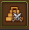
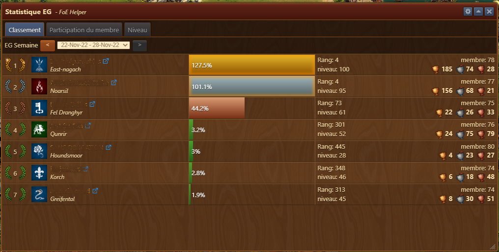
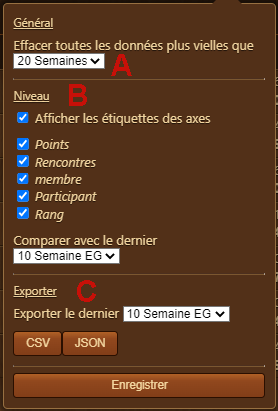
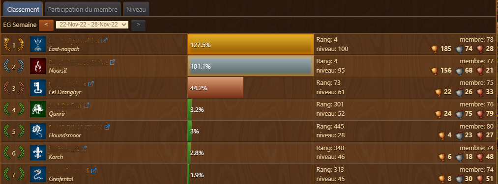
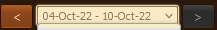
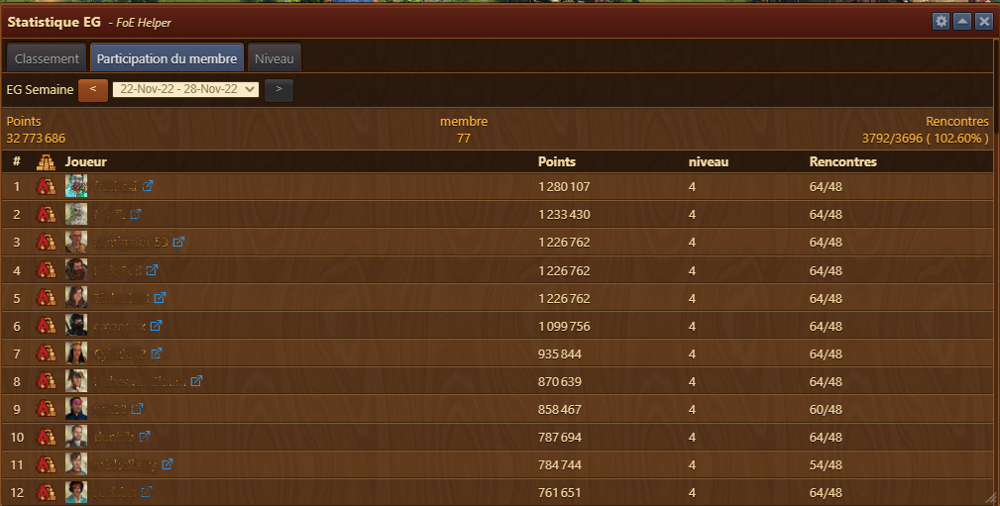
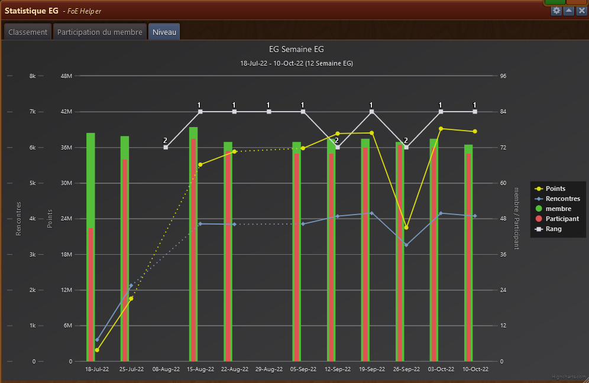

# Résultat de l'expédition de guilde

Ce module affiche les résultats de l'EG de votre guilde et permet de voir les résultats des EG précédentes.


Pour afficher des résultats à jour, vous devez visiter l'expédition de guilde et ouvir la fenêtre de contribution des membres


## Structure

La fenêtre affiche les informations sur l'EG dans 3 onglets et un menu de configuration qui permet d'exporter les données.

* La barre de titre avec le menu Configuration à droite 
* Onglet Classement - affiche le classement des guildes
* Onglet Participation du membre - affiche le nombre de rencontre / points fait par les membres de la guilde
* Onglet Niveau - Affiche sous forme graphique les rencontres / points et membres participants des EG passées et actuel

## Configuration

Le menu Configuration vous permet de 
* A) Fixer la durée de conservation des données pour l'affichage
* B) Fixer les axes du graphique et sur combien d'EG on compare les résultats
* C) Export des données sous forme CSV ou JSON et combien de semaines de résultats sont exportés

## Utilisation

### Onglet Classement

Vous pouvez naviguer dans les EG passées au moyen du système de navigation ou directement via le menu déroulant du choix de la date.

Sont affichés dans l'ordre 

* Classement de la guilde
* Emblème de la guilde
* Le nom de la guilde avec le lien vers la guilde sur [Scoredb.io](https://foe.scoredb.io) et sur quel monde cette guilde se trouve
* Le pourcentage d'atteinte de l'EG
* Le rang de la guilde sur son serveur et son niveau de guilde
* Le nombre de membre et les trophées en EG (Or / Argent / Bronze)

### Onglet Participation

Vous pouvez naviguer dans les EG passées au moyen du système de navigation ou directement via le menu déroulant du choix de la date.

Sont affichés dans l'ordre

* Le nombre de points obtenu
* Le nombre de membre de la guilde
* Le nombre de rencontre effectuées et le % que cela représente
* Le résultat de chaque jouer avec son nombre de point, le niveau atteint et le nombre de rencontre sur 64

### Onglet Niveau

En fonction des choix fait dans la [configuration](#Configuration) sont affichés

* Le nombre total de rencontres effectués par les membres de la guilde
* Le nombre de point effectués par les membres
* Le nombre de membre de la guilde
* Le nombre de points obtenu
* Le rang final

Si un résultat manque car vous n'avez pas ouvert la fenêtre de résultat EG, le résultat est affiché en trait discontinu pour le rang et le nombre de point, la barre représentant les membres et la participation ne sont pas affiché.