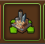
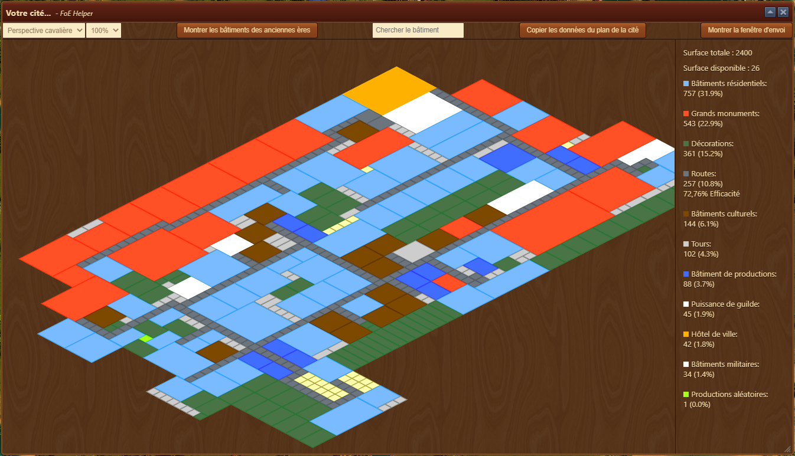
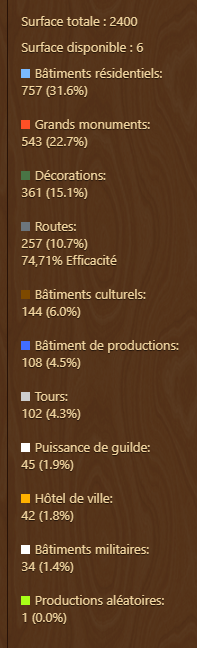
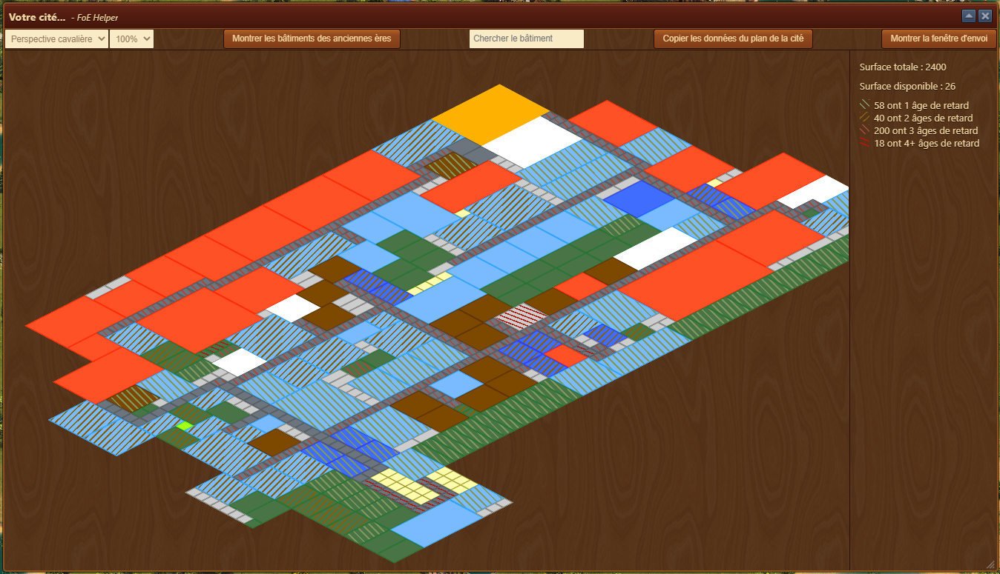
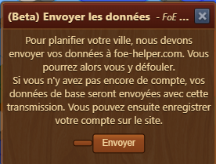

# Assistant Aperçu de la cité

 

L'assistant Aperçu de la cité vous affiche le plan de votre ville et permet aussi de l'exporter les données vers le site web https://foe-helper.com/

## Structure

Vous pouvez changer l'affichage de la ville entre perspective cavalière (commme la ville dans FoE) ou Standard (droite).
Vous pouvez aussi zoomer ou dézoomer l'affichage.

Vous pouvez bouger le plan dans la fenêtre, en cliquant-tenir sur le plan et en bougeant la souris.

## Utilisation

Sur la droite de la fenêtre, la légende vous donne des chiffes importants concernant votre ville. Dont l'efficacité en fonction du nombre de route posées.

### Montrer les bâtiments des anciennes ères

Hachure les surfaces des anciens bâtiements. Sur la droite, la couleur de l'hachure donne l'ancienneté du bâtiement par rapport à votre ère et le nombre de bâtiments concerné

### Recherche

Le champ Recherche permet de recherche un bâtiment. Sa surface clignote pour vous indiquer l'emplacement

### Copier les données du plan de la cité

Enregistre dans le presse-papier, sous forme de fichier JSON

### Montrer la fenêtre d'envoi

Permet d'envoyer les données de votre ville vers le [site web foe-helper.com](https://foe-helper.com/citymap/overview)

Une fenêtre de confirmation s'ouvre 

L'utilisation du planificateur sur le site web est décrit [ici](../../site_web/planificateur_cite/README.md)