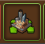
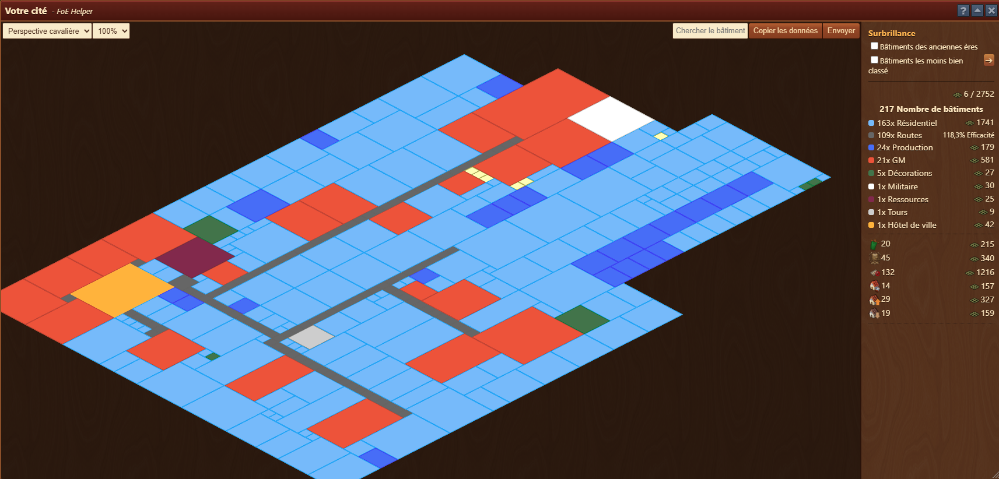
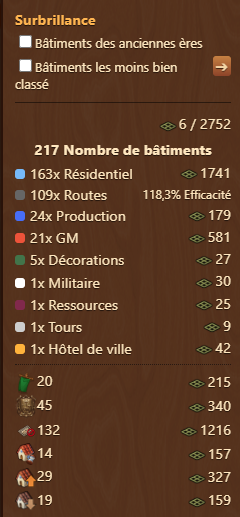
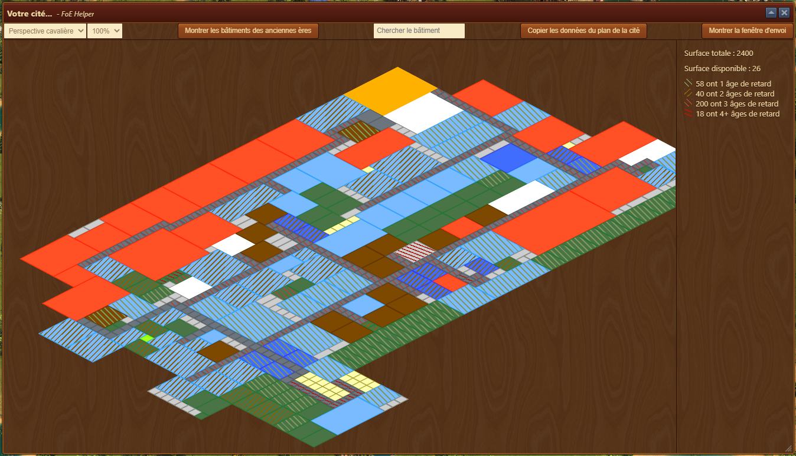
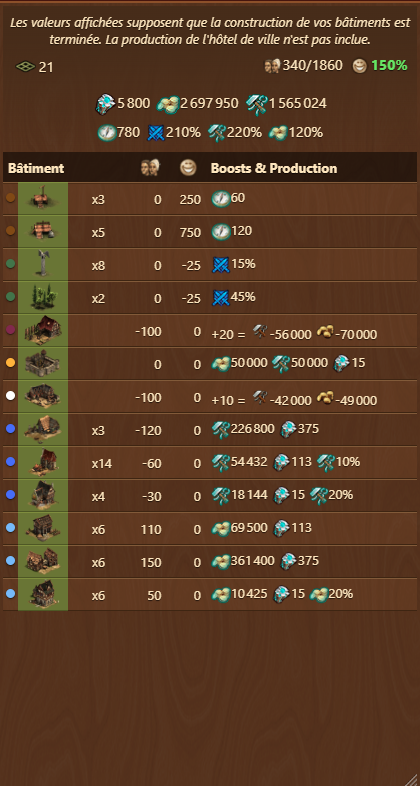
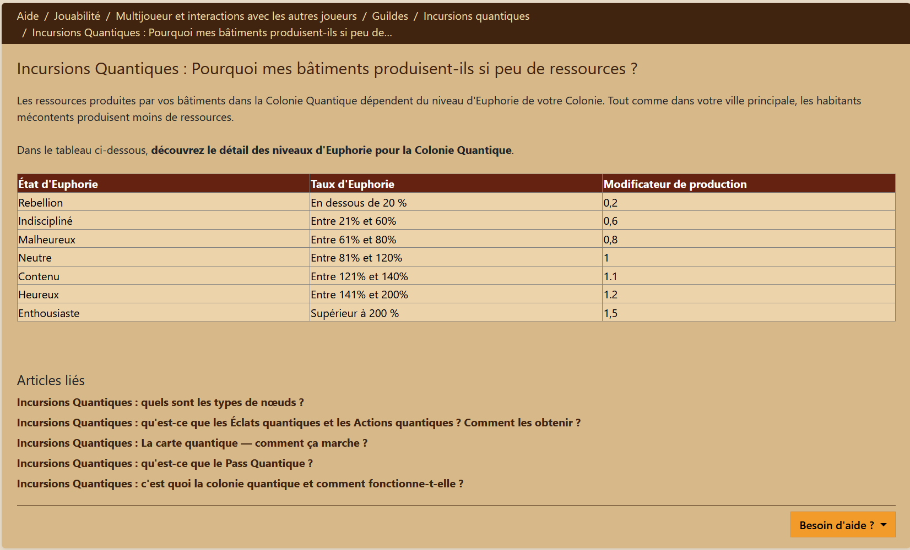

# Assistant Aperçu de la cité

 

L'assistant Aperçu de la cité vous affiche le plan de votre ville et permet aussi de l'exporter les données vers [site web foe-helper.com](https://foe-helper.com)

## Structure

Vous pouvez changer l'affichage de la ville entre perspective cavalière (commme la ville dans FoE) ou Standard (droite).
Vous pouvez aussi zoomer ou dézoomer l'affichage.

Vous pouvez bouger le plan dans la fenêtre, en cliquant-tenir sur le plan et en bougeant la souris.

### Champ Recherche
Le champ Recherche permet de recherche un bâtiment. Sa surface clignote pour vous indiquer l'emplacement

### Copier les données du plan de la cité

Enregistre dans le presse-papier, sous forme de fichier JSON

### Montrer la fenêtre d'envoi

Permet d'envoyer les données de votre ville vers le [site web foe-helper.com](https://foe-helper.com/citymap/overview)

Une fenêtre de confirmation s'ouvre 


L'utilisation du planificateur sur le site web est décrit [ici](../../site_web/planificateur_cite/README.md)


## Menu latéral 

Le menu latéral met à jour les données en fonction de la carte active actuelle dans le jeu :

- [**Cité principale**](#menu-ville-principale)
- [**Incursions Quantiques**](#menu-ville-quantique)

## Menu Ville principale

Sur la droite de la fenêtre, la légende vous donne des chiffes importants concernant votre ville. Dont l'efficacité en fonction du nombre de route posées.
Le carré disponible sur le total posssédé. (ici 6 sur 2752)

Pour les routes et le % d'efficacité affiché, c'est calculé ainsi : 
 "le nombre total de routes par rapport au nombre total de bâtiments qui ont besoin de routes plus leur dimension"

### Surbrillance

case à cocher pour mettre en Surbrillance les bâtiments des anciennes ères

case à cocher pour mettre en surbrillance les bâtiments les moins bien classé selon [Evaluation d'éfficacité des bâtiments](../efficience/README.md)

### Chiffre clé sur l'occupation du sol

Donne le nombre de batiments et par genre (résidentiel, route, production, armée, ect..) et le nombre de carrés occupés.

dans la 2e partie, on peut mettre en évidence certains type de bâtiments :
(la mise en évidence, comme le retour à l'affichage normal, se fait en cliquant sur le nombre)

- **Issu du CbG**
- **Issu de l'IQ**
- **Bâtiments ne nécessistant aucune route**
	! [bâtiment sans route](./.images/batiment_sans_route.png)
- **Bâtiments augmentables / limités**
- **Bâtiments améliorables**
- **Bâtimeents limités échus

## Menu Ville quantique

il donne les infos suivantes :

- nombre de tuiles occupées
- nombre d'habitants / joie acquise / [Etat et % d'euphorie](https://support.innogames.com/kb/ForgeOfEmpires/fr_FR/2972/Incursions-Quantiques--Pourquoi-mes-b%C3%A2timents-produisentils-si-peu-de-ressources-) [image](#euphorie)
- nombre de chronos, d'or et marchandise
- nombre d'action gagnée par cycle, le % de combat et sa couleur, le % de gain sur les marchandises et l'or

La liste de tous les bâtiments 

- avec le nombre, le besoin en population ou la population fournie, l'euphorie apportée ou enlevée, boosts et productions fournies

### euphorie

