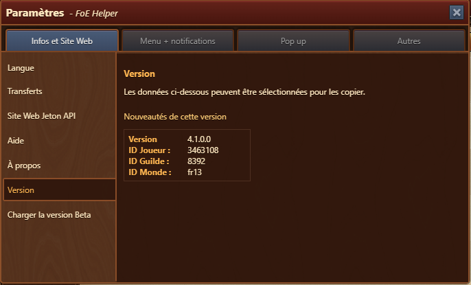
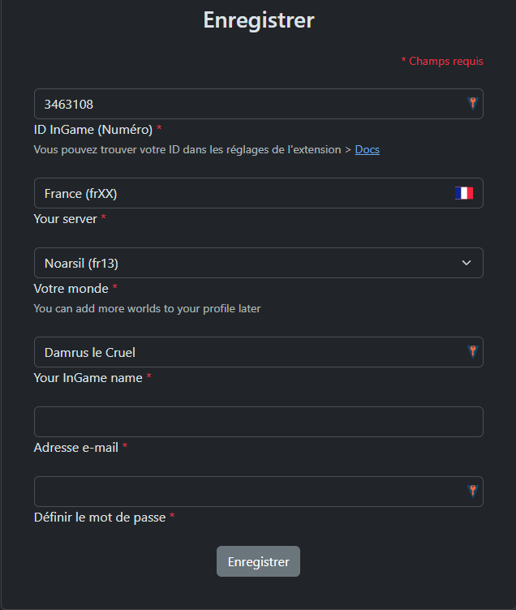

Pour utiliser pleinement les fonctionnalités de l'extension FOE Helper, vous devrez créer un compte sur le site Web de Foe Helper.

# Créer un compte

Pour enregistrer votre compte, vous devez vous rendre sur la page Web suivante : [Enregistrer le compte](https://foe-helper.com/register/player?lang=fr)

Le formulaire de création de compte comporte les champs obligatoires suivants :

| Champ | Descriptif |
|-----------|-------------|
| **ID dans le jeu** (ID InGame) | Un identifiant numérique de l'extension FOE Helper. Vous pouvez le trouver dans les paramètres de l'extension FoE Helper. |
| **Votre serveur**  (You Server)| Sélectionnez votre serveur FoE. Vous pouvez le trouver dans les paramètres de l'extension FoE Helper. Le code à deux lettres au début de « Monde » indique votre serveur (par exemple « EN » pour le serveur International). |
| **Votre monde** | Choisissez le monde dans lequel vous jouez. Vous pouvez le trouver dans les paramètres de l'extension FoE Helper. |
| **Votre nom en jeu** (Your InGame Name)| Votre nom d'utilisateur Forge of Empires dans le jeu. |
| **Adresse e-mail** | Une adresse e-mail valide à associer à votre compte. |
| **Définir un nouveau mot de passe** | Choisissez un mot de passe sécurisé pour protéger votre compte. |

Vous pouvez trouver les informations nécessaires dans l'extension de navigateur FoE Helper en allant dans **Paramètres → Version**.

## Exemple de formulaire rempli

## Conseils

- N'utilisez pas le mot de passe du compte Forge of Empires.
- Utilisez un **mot de passe fort** (au moins 8 caractères recommandés).
- Vous pouvez ajouter plus de mondes après inscription dans les paramètres de votre profil.