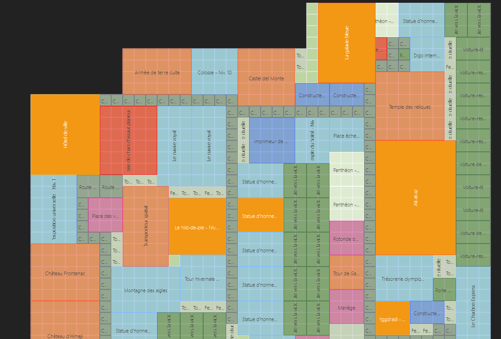
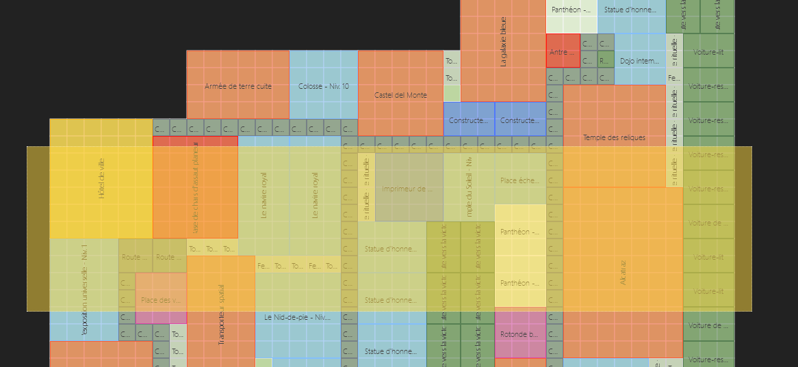
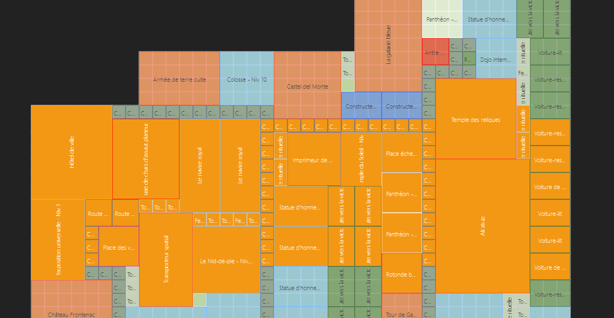
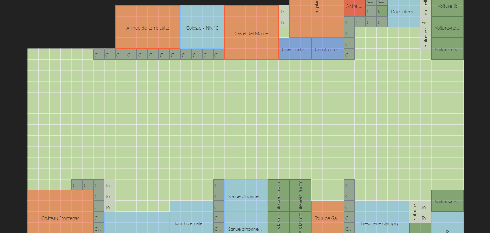
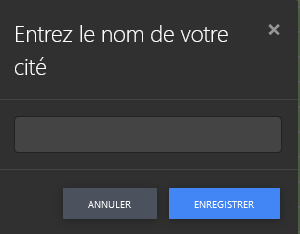
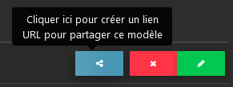

# Le planificateur de cité

## Que peut faire cet outil ?
Cet outil est parfait pour planifier différentes variantes d'une ville ou pour faire planifier sa ville par un collègue ou un ami de la guilde.
c'est ainsi que vous pouvez transmettre un lien de partage permettant à quelqu'un de planifier votre ville. 

## Aperçu

Le planificateur de cité est atteignable via le site web, via le menu, en haut, "Outils" :

Dans l'aperçu sont affichés vos villes. Votre ville principale, mais aussi vos colonies si vous les avez téléchargées et sauvegardées ici :

## Editer sa ville
 
En cliquant sur "Nouvelle cité", vous verrez quelles données sont disponibles. Vous devez avoir envoyé ceci à ce serveur à partir de l'extension Assistant FoE. 
Ce sera principalement votre ville elle-même et/ou la dernière colonie que vous avez soumis.

Lors du premier appel, tous les bâtiments sont toujours sur la carte. Votre ville est construite comme ça. 

---

Avec un clic sur "enlever les bâtiments" vous envoyez tous les bâtiments de la carte sur le côté gauche.

---

Vous pouvez aussi avec CTRL + clic gauche de la souris marquer des bâtiments individuellement.

.... et avec la touche "Del" / "Suppr" vous pouvez envoyer ces bâtiments dans la barre latérale.

Avec la touche Shift / Maj + le bouton de gauche de la souris, vous pouvez aussi dessiner un rectangle en commençant en dehors de la carte en tirant par-dessus les bâtiments. Et ensuite à nouveau avec la touche "Del" / "Suppr" les envoyer dans la barre latérale.

Tous les bâtiments touchant le carré orange sont pris en compte. Le bâtiment n'a pas à être entièrement à l'intérieur. 

Avec ces aides, vous n'avez pas à pousser chaque bâtiment vers la gauche. Ce qui bien sûr est aussi possible. 

---

Il existe deux options pour enregistrer. La première fois que vous enregistrez, il vous sera demandé un nom. 
Si vous l'avez enregistré avec succès, votre ville sera automatiquement enregistrée toutes les 30 secondes en arrière-plan. 

Si vous ouvrez une ville existante, elle sera enregistrée en arrière-plan toutes les 30 secondes après l'ouverture. De cette façon, aucun progrès n'est perdu. 

---

Si vous ne disposez pas de plusieurs moniteurs (lors de la transformation effective de la ville dans le jeu), vous pouvez télécharger votre ville comme PDF ou comme PNG. 
Ceci est est possible avec les boutons "Télécharger le pdf" ou "Télécharger le png".

## Libérer la ville

Si vous souhaitez que quelqu'un d'autre planifie votre ville pour vous, vous pouvez créer un "Lien de partage" dans l'aperçu : 

Si vous supprimez le lien de partage, la ville ne pourra plus être rappelée sous celui-ci. Vous devez en créer un nouveau et le transmettre à nouveau. 

