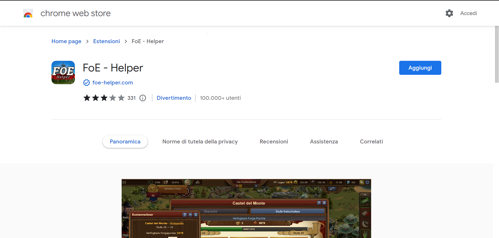

# Estensione FoE Helfer

FoE Helper è un'estensione per il browser che "sovrappone" il gioco e può analizzare i dati inviati dal gioco al browser.

Poiché non vengono manipolati dati, né automatizzate azioni o apportate altre modifiche, questa estensione non è ufficialmente approvata da InnoGames, ma non viola alcuna regola del gioco ed è quindi tollerata.

## Installazione di FoE Helper

FoE Helper è adatto a tutti i browser basati su Chromium.

Questi sono i più famosi: [Google Chrome](https://www.google.com/chrome/), Microsoft Edge, [Opera](https://www.opera.com/) [(GX)](https://www.opera.com/de/gx), [Vivaldi](https://vivaldi.com/), [Brave](https://brave.com/), [Blisk](https://blisk.io/), [Colibri](https://colibri.opqr.co/), [Epic Browser](https://www.epicbrowser.com/), [Iron- oder SW Browser](https://www.srware.net/iron/), e molti altri...

Inoltre, Firefox è supportato anche come variante non Chromium-based.

Esiste una voce del negozio per Chrome, Microsoft e Firefox. Per Opera e per altri browser basati su Chromium esiste un piccolo lavoro.

## Installazione per Chrome

Accedere al Chrome Web Store: [Chrome Store](https://chrome.google.com/webstore/detail/foe-helper/bkagcmloachflbbkfmfiggipaelfamdf)  e clicca il bottone "Aggiungi" in alto a destra.

L'estensione verrà automaticamente aggiunta al tuo browser dopo la tua conferma.

Se hai già aperto il gioco in una delle tue schede devi ricaricare la finestra!

Dopo aver aperto il gioco, apparirà una barra aggiuntiva nell'angolo in basso a destra.

## Microsoft Edge

Simile a Chrome, qui l'estensione può essere semplicemente selezionata dal [Microsoft Store](https://microsoftedge.microsoft.com/addons/detail/foe-helfer/cpmacpalonncbafboibpcjcpadloannb) scaricandola e installandola.

L'installazione da qui in poi è la stessa di Chrome.

## Browser Opera

Con un piccolo strumento puoi facilmente installare qualsiasi estensione di Chrome in un browser Opera. Questo può valere anche per tutti gli altri browser basati su Chromium. Varia da caso a caso.

1. Apri nel tuo browser Opera (PC) [Opera Store](https://addons.opera.com/de/extensions/details/install-chrome-extensions/) e installalo.
2. Riavviare Opera.
3. Apri il Chrome Webstore in Opera ed esegui i seguenti passaggi come descritto in "Installazione per Chrome". 

4. Confermare la modalità di compatibilità 
5. Nel passaggio successivo vi verrà proposto di installare l'estensione. Fare clic su "Installa", confermare le autorizzazioni per l'applicazione.
6. Riavviare il browser e godersi il gioco con l'assistente.