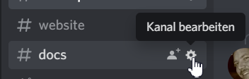
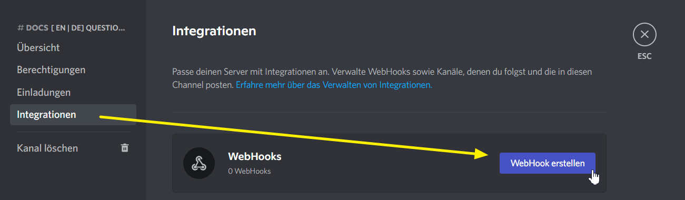
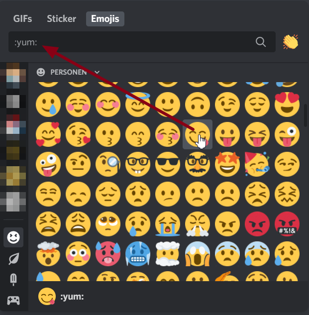

# Webhook Discord

## Crea un webhook in Discord


Sono necessari i diritti appropriati per creare un webhook.


È possibile creare un webhook per qualsiasi canale in Discord. Per fare ciò, procedere come segue.

Fai clic sull'ingranaggio accanto al canale in cui desideri che vengano visualizzate le notifiche:

Lì fai clic su “Integrazioni” > “Crea WebHook”:

Cambia il nome in qualcosa di significativo in modo da sapere in seguito di che tipo di webhook si tratta. Il nome del bot che pubblica il messaggio non ha nulla a che fare con questo.

Quindi fare clic sul pulsante "Copia URL WebHook" e chiudere tutte le finestre. Hai finito con Discord.

## Includi WebHook nell'helper


Se vuoi lavorare con gli eventi delle battaglie tra gilde, devi visitarli una volta prima di crearli.


Compila i campi come indicato.


**Icone** Puoi utilizzare qualsiasi icona del tuo canale Discord. Per fare ciò, passa con il mouse su un'icona nel canale e inseriscila nel testo con _:nome:_.


Una nuova riga viene semplicemente inserita con il tasto Invio (interruzione di riga).

Attualmente esiste solo l'evento "Guildfights" (primo attacco) in combinazione con un settore. Questo è un test BETA, per così dire.

Per ottenere un corpo del testo con il nome della provincia, puoi usare <mark style="color: #e83e8c;">#gg_province_name#</mark>. Verrà sostituito al momento della spedizione.

## Utilizzo di un evento

Poiché è noto che l'helper FoE non interroga i dati in modo indipendente, l'evento deve essere attivato nel gioco mentre si è connessi.

Spiegazione: **Un** giocatore singolo per gilda crea il webhook e poi deve lasciare aperta la mappa della gilda. Non è necessario altro. Questi webhook inviano eventi globali a un canale, il che significa che non avrebbe molto senso per scopi privati.

Non appena sullo sfondo del gioco arrivano informazioni su un attacco, viene impostato il trigger e il messaggio viene inviato automaticamente una volta a Discord. Tutti i follower di questo canale possono leggerlo.

## Altri eventi

Manca un evento o hai ancora una buona idea?

Quindi completa semplicemente questo ticket: [https://github.com/mainIine/foe-helfer-extension/issues/2543](https://github.com/mainIine/foe-helfer-extension/issues/2543)