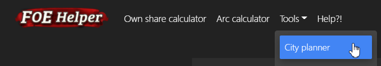
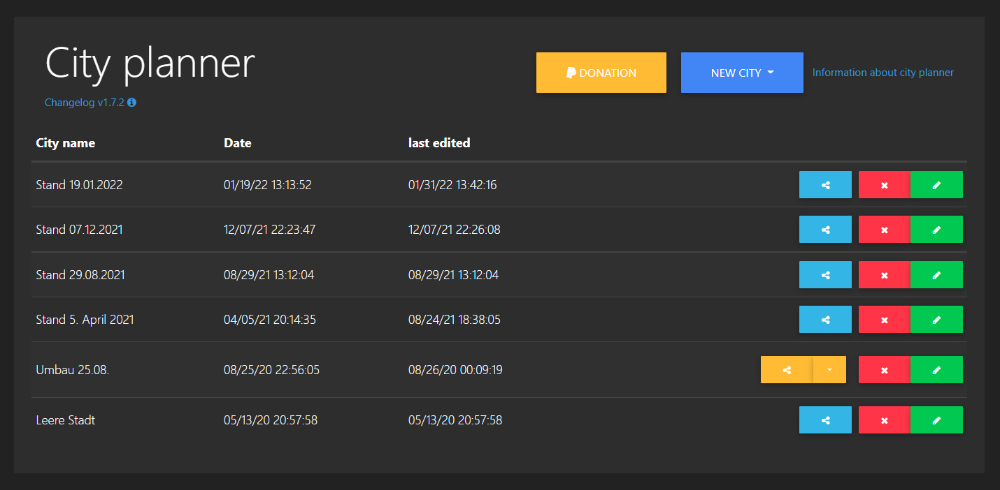
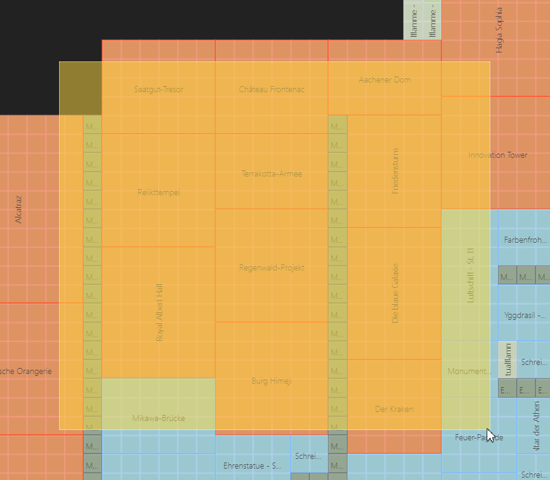
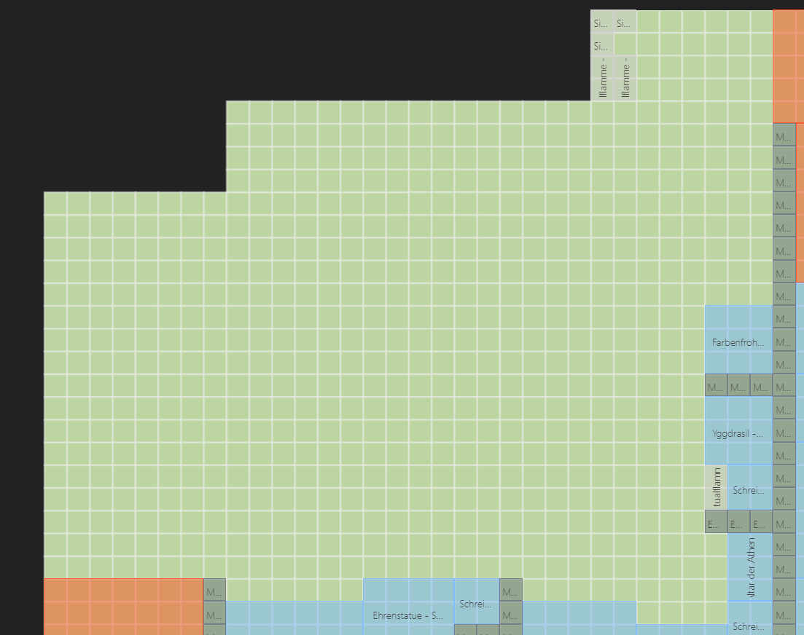
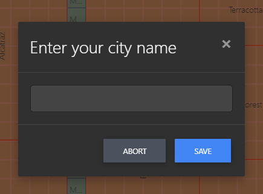
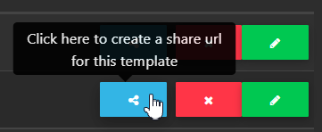

# Urbanista

## Cosa può fare questo strumento?
Per pianificare diverse varianti di una città o per chiedere a un collega o amico della gilda di pianificare la città, questo strumento è la cosa giusta. 
Puoi trasmettere un link di condivisione, che consente all'editor di pianificare la tua città.

## Panoramica

Puoi accedere all'urbanista nella parte superiore del sito Web tramite il menu "Strumenti":

Le tue città vengono visualizzate nella panoramica. La tua capitale, ma anche tutti i tuoi avamposti se li hai caricati e salvati qui:

## Modifica città

Clicca su "Nuova città" per vedere quali dati sono disponibili.
Devi aver inviato questi dati dall'estensione helper FoE a questo server. 
Di solito questa sarà la tua stessa città e/o l'ultimo avamposto che hai inviato.

Tutti gli edifici sono sempre sulla mappa quando li richiami per la prima volta. Anche la tua città è costruita così.

---

Clicca su "Rimuovi edifici" per spostare tutti gli edifici sulla mappa a sinistra nella barra del sito.

---

Puoi anche contrassegnare i singoli edifici con CTRL + tasto sinistro del mouse...

... e spostalo nella barra laterale con il tasto "Canc".

Con Shift + tasto sinistro del mouse puoi disegnare un quadrato, partendo fuori dalla mappa, sopra gli edifici che vuoi inviare alla barra laterale con il tasto "Canc":

Vengono presi in considerazione tutti gli edifici che toccano il quadrato arancione. L'edificio non deve trovarsi completamente al suo interno.

Con questi aiuti, non devi spostare ogni singolo edificio a sinistra. Che ovviamente funziona anche.

---

Ci sono due opzioni per salvare. La prima volta che salvi, ti verrà chiesto un nome. 
Se hai salvato con successo, la tua città verrà salvata automaticamente in background ogni 30 secondi.

Se apri una città esistente, viene immediatamente salvata in background ogni 30 secondi dopo l'apertura. Quindi nessun progresso è perso.

---

Se non hai più monitor, TU puoi salvare la tua città come grafica o come grafica PNG trasparente. 
Puoi farlo con i pulsanti "Download PDF" o "Download PNG".

## Condividi città

Se vuoi che qualcun altro pianifichi la tua città per te, puoi creare un "Link di condivisione" nella panoramica.:

---

Clicca su copia per copiarlo negli appunti del tuo dispositivo.:

Se elimini il link di condivisione, la città non può essere richiamata nuovamente sotto questo link. Devi crearne uno nuovo e condividerlo di nuovo.

